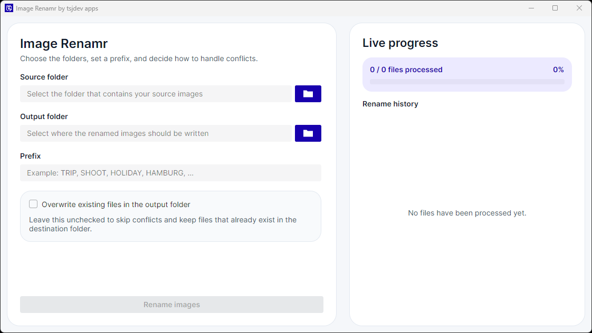
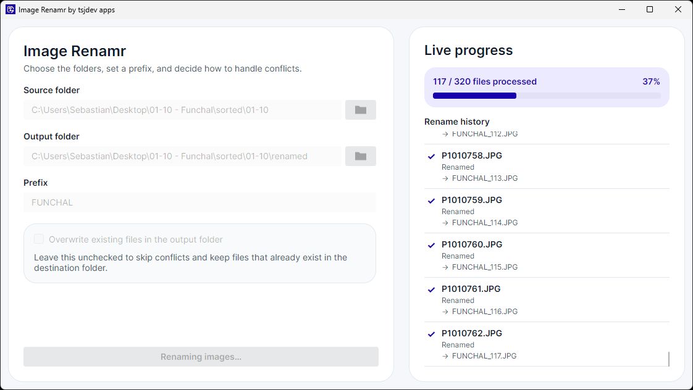
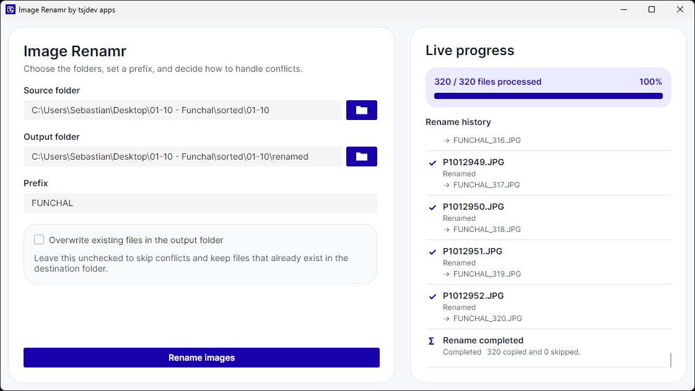

# Image Renamr

Image Renamr is a cross-platform desktop app for renaming entire folders of images without turning the task into a script. Built with Avalonia on .NET 10, it offers a focused two-panel workflow: configure a batch on the left and follow every processed file in the live progress history on the right.


The project is aimed at everyday image-organization jobs such as preparing travel photos, normalizing mixed camera exports, cleaning up filenames before archival, or producing consistently named handoff folders for clients and teams.

## Highlights

- Batch rename supported images from a desktop UI
- Copy files into a separate output folder with predictable numbering
- Use a shared prefix with automatic zero-padded sequence numbers
- Preserve the original file format of every copied image
- Skip or overwrite existing files in the output folder
- Track processed files through a live, scrollable rename history
- See original and generated file names for every handled image
- Distinguish renamed, overwritten, skipped, and failed files at a glance
- Finish every batch with a dedicated summary entry
- Follow the operating system's light or dark appearance
- Use the complete interface in English or German, selected from the OS UI language
- Support `.jpg`, `.jpeg`, `.png`, `.gif`, `.bmp`, `.tif`, `.tiff`, `.webp`, and `.avif`

> Note: the current rename workflow processes files from the selected input folder only. It does not recurse into nested subfolders.

## Screenshots

### Rename configuration



The main screen follows the same visual language as Image Sortr. Rename configuration and live progress share the available height, while the start button remains anchored at the bottom of the configuration card.

### Live progress during a running batch



While a batch is running, Image Renamr updates the processed and total file counts, percentage, and progress bar after each file. The virtualized history keeps the newest result visible while remaining efficient for large folders.

### Completion summary



Each history row shows a non-color status marker, localized status text, the original file name, and the generated target name where applicable. After processing, a final summary row reports the copied and skipped totals without opening a separate report view.

## Rename Workflow

1. Select the folder that contains the source images.
2. Choose where the renamed copies should be written.
3. Enter the prefix that should be used for the generated file names.
4. Decide whether to skip or overwrite existing output files.
5. Start the batch and follow each result in the live progress panel.

Starting another batch clears the previous progress values and rename history. Existing targets are either skipped or overwritten according to the selected option; file-system or permission failures remain visible in the history before the batch stops.

## Supported Formats

Image Renamr currently accepts the following input file types:

- `.jpg`
- `.jpeg`
- `.png`
- `.gif`
- `.bmp`
- `.tif`
- `.tiff`
- `.webp`
- `.avif`

Renamed output files keep the original file extension and are written as copies into the selected output folder.

## Localization and Themes

Image Renamr uses standard .NET resources with English as the neutral fallback language:

- English: `src/ImageRenamr.App/Resources/Localization/Strings.resx`
- German: `src/ImageRenamr.App/Resources/Localization/Strings.de.resx`

The application reads `CultureInfo.CurrentUICulture` at startup. German regional cultures such as `de-DE`, `de-AT`, and `de-CH` use the German interface; unsupported UI cultures fall back to English.

The Avalonia theme follows the operating system's light or dark preference. Image Renamr retains its purple `#1800AD` accent color in both variants.

## Getting Started

### Prerequisites

- .NET SDK matching the version pinned in `global.json`

### Restore

```bash
dotnet restore ImageRenamr.slnx
```

### Build

```bash
dotnet build ImageRenamr.slnx --configuration Release
```

### Run the desktop app

```bash
dotnet run --project src/ImageRenamr.App/ImageRenamr.App.csproj --configuration Release
```

### Run the tests

```bash
dotnet test ImageRenamr.slnx --configuration Release
```

There is no separate lint command. Repository analyzers and code-style checks run as part of the build.

## Project Structure

- `src/ImageRenamr.App`: Avalonia desktop UI, localization resources, and MVVM presentation state
- `src/ImageRenamr.Core`: rename pipeline, structured progress models, validation, and file handling
- `tests/ImageRenamr.Tests`: xUnit tests for the rename service, progress history, and localization

The solution intentionally keeps the UI thin. Avalonia-specific code lives in the app project, while the rename workflow, validation, file handling, and progress reporting live in the core library.

## Tech Stack

- [.NET 10](https://dotnet.microsoft.com/)
- [Avalonia UI](https://avaloniaui.net/)
- [Semi.Avalonia](https://github.com/irihitech/Semi.Avalonia)
- [CommunityToolkit.Mvvm](https://learn.microsoft.com/dotnet/communitytoolkit/mvvm/)
- [xUnit](https://xunit.net/)

## Quality

The repository includes automated coverage for the batch rename service, window view model, structured history entries, and localization resources. Tests verify deterministic ordering, file handling, overwrite rules, prefix validation, percentage calculation, reset and summary behavior, UI-thread progress marshaling, German regional cultures, singular/plural formatting, and English fallback.

## License

This project is licensed under the MIT License. See [LICENSE](LICENSE) for details.
